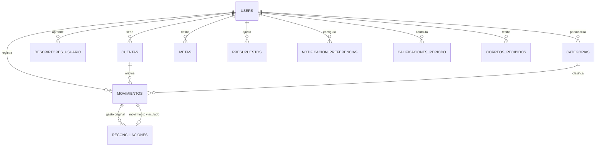

# Cacao — Esquema de base de datos (v1)

Estado: **propuesta**, para tu revisión antes de correr la migración. SQL
completo en [`supabase/migrations/0001_init.sql`](../supabase/migrations/0001_init.sql).

## Principios de diseño

- **Postgres vía Supabase**, con `auth.users` manejando login (Apple/Google/
  email) — todas las tablas propias cuelgan de `auth.users.id`.
- **Row Level Security fuerza la regla de privacidad a nivel de base de
  datos**, no solo en la app: cada tabla con datos de un usuario tiene una
  política `user_id = auth.uid()`. Solo `formatos_correos` y
  `comercios_genericos` son de lectura pública (para todo usuario
  autenticado) — son las únicas tablas compartidas, y ninguna de las dos
  contiene montos ni datos de transacciones, tal como pide DECISIONS.md.
- **Montos con signo**: positivo = ingreso, negativo = gasto. Es la
  convención estándar de un ledger y evita necesitar una columna aparte de
  "dirección".
- **No se sobrescriben montos originales**: un reembolso marca la
  transacción como anulada (no borra ni cambia el monto); una reconciliación
  crea un registro nuevo vinculado. Esto es requisito explícito de
  DECISIONS.md, no una preferencia de diseño.
- **Categorías son datos, no un enum fijo de Postgres**: el usuario puede
  agregar categorías propias (brief lo pide explícitamente), así que
  `categorias` es una tabla con una fila por categoría — las de sistema
  tienen `user_id NULL`, las del usuario tienen su `user_id`.

## Diagrama de entidades

`formatos_correos` y `comercios_genericos` quedan fuera del diagrama a
propósito: son catálogos compartidos entre usuarios, no cuelgan de
`USERS`.

## Tablas

### `public.users` (perfil, 1:1 con `auth.users`)
| Columna | Tipo | Notas |
|---|---|---|
| `id` | uuid PK | = `auth.users.id` |
| `tracking_email` | text | correo de rastreo, distinto al de login |
| `salario_fijo_mensual` | numeric | exacto, del cuestionario de perfil |
| `ingreso_no_fijo_aproximado` | numeric | referencia, no autoritativo (ver DECISIONS.md) |
| `corte_tipo` | enum(`mensual`,`quincenal`) | |
| `corte_dia` | int | día de corte si `corte_tipo = mensual` |
| `stripe_customer_id` | text | nullable |
| `subscription_status` | enum(`trial`,`activa`,`vencida`,`cancelada`) | default `trial` |
| `trial_ends_at` | timestamptz | |
| `created_at` | timestamptz | |

RLS: `id = auth.uid()`.

### `cuentas`
| Columna | Tipo | Notas |
|---|---|---|
| `id` | uuid PK | |
| `user_id` | uuid FK → users | |
| `banco` | enum(`santander`,`nu`,`plata`,`bbva`,`otro`) | |
| `nombre` | text | asignado por el usuario |
| `tipo` | enum(`debito`,`credito`) | |
| `terminacion` | text(4) | últimos 4 dígitos, no el número completo |
| `activa` | bool | default true |
| `created_at` | timestamptz | |

RLS: `user_id = auth.uid()`.

### `categorias`
| Columna | Tipo | Notas |
|---|---|---|
| `id` | uuid PK | |
| `user_id` | uuid FK → users, **nullable** | `NULL` = categoría de sistema (compartida, de solo lectura) |
| `nombre` | text | ej. "Take-out", o una propia del usuario |
| `tipo_default` | enum(`fijo`,`semi_fijo`,`variable`,`na`) | asignación automática, recategorizable |
| `es_especial` | bool | true para Intereses Financieros, Cashback, Reembolso, Transferencia |
| `created_at` | timestamptz | |

Seed inicial: las 23 categorías de la taxonomía v1 con `user_id = NULL`
(ver sección "Seed data" abajo). RLS: lectura de filas con `user_id IS NULL`
para todo usuario autenticado, o `user_id = auth.uid()` para las propias;
escritura solo sobre las propias.

### `movimientos`
La tabla central — cubre correo bancario, efectivo manual, e ingresos no
ordinarios.

| Columna | Tipo | Notas |
|---|---|---|
| `id` | uuid PK | |
| `user_id` | uuid FK → users | |
| `cuenta_id` | uuid FK → cuentas, nullable | null si es registro manual sin cuenta asociada |
| `categoria_id` | uuid FK → categorias, nullable | null = "Necesita revisión" |
| `id_transaccion_externo` | text, nullable | id del banco, para no duplicar al reprocesar un correo |
| `monto` | numeric | con signo: + ingreso, − gasto |
| `fecha_operacion` | date | |
| `hora_operacion` | time, nullable | |
| `descriptor_crudo` | text, nullable | texto tal cual del correo; null si es manual |
| `nombre_limpio` | text | lo que ve el usuario en Movimientos |
| `tipo_gasto` | enum(`fijo`,`semi_fijo`,`variable`,`na`) | snapshot editable por transacción, default = `categorias.tipo_default` |
| `medio` | enum(`fisico`,`digital`) | |
| `credit_kind` | enum(`credit_expense`,`credit_payment`), nullable | solo aplica a cuentas de crédito |
| `origen` | enum(`bot`,`manual`) | |
| `estado` | enum(`ok`,`necesita_revision`) | |
| `reembolsado` | bool | default false — si true, no cuenta en gasto del periodo |
| `fecha_reembolso` | timestamptz, nullable | |
| `monto_reembolso` | numeric, nullable | normalmente = `monto` |
| `created_at` | timestamptz | |

RLS: `user_id = auth.uid()`. Índice único parcial en
`(user_id, cuenta_id, id_transaccion_externo)` donde no es null, para
que reprocesar un correo (dentro del colchón de 48h) sea idempotente.

### `reconciliaciones`
Registro nuevo vinculado a un gasto original — nunca sobrescribe el monto
original (distinto de un reembolso).

| Columna | Tipo | Notas |
|---|---|---|
| `id` | uuid PK | |
| `movimiento_original_id` | uuid FK → movimientos | el gasto que muestra el indicador visual |
| `monto_descontado` | numeric | |
| `fecha` | timestamptz | |
| `origen_texto` | text | quién transfirió, texto libre |
| `movimiento_vinculado_id` | uuid FK → movimientos, nullable | si el ingreso entrante también quedó como su propio movimiento |
| `created_at` | timestamptz | |

RLS: vía el `user_id` del `movimiento_original_id` (policy con subquery).

### `descriptores_usuario`
Tabla de frecuencia por usuario — el corazón del autocompletado
determinístico (sección "Predicción y autocompletado" de DECISIONS.md).

| Columna | Tipo | Notas |
|---|---|---|
| `id` | uuid PK | |
| `user_id` | uuid FK → users | |
| `descriptor_normalizado` | text | descriptor crudo limpio (sin folios/fechas) |
| `nombre_limpio` | text | |
| `categoria_id` | uuid FK → categorias | |
| `veces_visto` | int | default 1, +1 cada vez que se confirma esta categoría |
| `categorias_mixtas` | bool | true si se ha visto con más de una categoría — fuerza "Necesita revisión" aunque `veces_visto >= 2` |
| `monto_tipico` | numeric, nullable | último monto visto, para detección de "monto recurrente" |
| `veces_mismo_monto` | int | default 0, +1 cuando el monto nuevo == `monto_tipico` (con tolerancia) |
| `updated_at` | timestamptz | |

RLS: `user_id = auth.uid()`. **Nunca compartida entre usuarios** — es
exactamente la tabla que DECISIONS.md prohíbe cruzar entre usuarios.

Único constraint: `(user_id, descriptor_normalizado)`.

### `formatos_correos` (compartida, sin datos de transacciones)
| Columna | Tipo | Notas |
|---|---|---|
| `id` | uuid PK | |
| `banco` | enum(`santander`,`nu`,`plata`,`bbva`) | |
| `patron_remitente` | text | regex/dominio del remitente |
| `patron_asunto` | text, nullable | regex del asunto, si aplica |
| `mapeo_campos` | jsonb | dónde extraer monto/fecha/hora/terminación/id — el detalle de esta gramática se define en la arquitectura del bot |
| `version` | int | se incrementa cuando el banco cambia su formato |
| `activo` | bool | |
| `fuente` | enum(`equipo`,`usuario_pdf`) | cómo se agregó (PDF subido por un usuario cuenta como `usuario_pdf`) |
| `created_at` / `updated_at` | timestamptz | |

RLS: lectura pública para todo usuario autenticado; escritura solo con el
rol de servicio (el bot, o un panel interno) — nunca directo desde el
cliente.

### `comercios_genericos` (cold start, compartida, sin datos de usuario)
| Columna | Tipo | Notas |
|---|---|---|
| `id` | uuid PK | |
| `patron_comercio` | text | ej. "OXXO" |
| `categoria_id` | uuid FK → categorias (categoría de sistema) | |
| `nombre_limpio_sugerido` | text | |

RLS: lectura pública; escritura solo rol de servicio.

### `metas`
| Columna | Tipo | Notas |
|---|---|---|
| `id` | uuid PK | |
| `user_id` | uuid FK → users | |
| `tipo` | enum(`periodo`,`anual`,`fondo_emergencia`) | |
| `monto_objetivo` | numeric | |
| `gastos_altos_frecuentes` | bool, nullable | respuesta al cuestionario del fondo de emergencia — determina 3 vs. 6 meses |
| `activa` | bool | default true |
| `created_at` | timestamptz | |

RLS: `user_id = auth.uid()`.

### `presupuestos`
| Columna | Tipo | Notas |
|---|---|---|
| `id` | uuid PK | |
| `user_id` | uuid FK → users | |
| `categoria_id` | uuid FK → categorias | |
| `monto_mensual` | numeric | sugerido por 50/30/20, ajustable |
| `updated_at` | timestamptz | |

RLS: `user_id = auth.uid()`. Único: `(user_id, categoria_id)`.

### `notificacion_preferencias`
| Columna | Tipo | Notas |
|---|---|---|
| `id` | uuid PK | |
| `user_id` | uuid FK → users | |
| `tipo` | enum(`limite_presupuesto`,`cierre_periodo`,`transaccion_desconocida`,`recomendaciones_app`) | |
| `activo` | bool | default true |

RLS: `user_id = auth.uid()`. Único: `(user_id, tipo)`.

### `calificaciones_periodo`
Historial de la calificación de hábitos (1-10) por periodo — necesario para
mostrar "mejor que el periodo pasado" en el dashboard sin recalcular todo
cada vez.

| Columna | Tipo | Notas |
|---|---|---|
| `id` | uuid PK | |
| `user_id` | uuid FK → users | |
| `periodo_inicio` / `periodo_fin` | date | |
| `calificacion` | int | 1-10 |
| `tasa_ahorro` | numeric | |
| `ganancia_ahorro_neta` | numeric | Free money vs. periodo anterior |
| `estrategias_cumplidas_pct` | numeric | |
| `created_at` | timestamptz | |

RLS: `user_id = auth.uid()`. Único: `(user_id, periodo_inicio)`.

### `correos_recibidos`
Seguimiento de retención (colchón de 48h prod / 7 días beta) — no guarda el
contenido del correo, solo metadata para saber cuándo purgar.

| Columna | Tipo | Notas |
|---|---|---|
| `id` | uuid PK | |
| `user_id` | uuid FK → users | |
| `message_id` | text | id del proveedor de correo |
| `fecha_recibido` | timestamptz | |
| `fecha_procesado` | timestamptz, nullable | |
| `extraido_ok` | bool, nullable | |
| `fecha_borrado_programada` | timestamptz | `fecha_recibido` + colchón según entorno |
| `borrado` | bool | default false |

RLS: `user_id = auth.uid()`.

## Lógica derivada (no vive en columnas, se calcula)

- **Detección de "monto recurrente por descriptor"** (para Ejercicio →
  Fijo): al procesar un movimiento, el bot busca/crea la fila en
  `descriptores_usuario`. Si `monto` ≈ `monto_tipico` (tolerancia ~1%),
  `veces_mismo_monto += 1`; si `veces_mismo_monto >= 2`, el `tipo_gasto`
  del movimiento se fuerza a `fijo` sin importar el default de la
  categoría. Ver propuesta detallada en la sección siguiente del proyecto
  (arquitectura del bot).
- **Presupuesto 50/30/20**: se calcula una vez del
  `salario_fijo_mensual` (+ opcionalmente `ingreso_no_fijo_aproximado`) al
  completar el onboarding, y se guarda como fila inicial en
  `presupuestos` por categoría — después es 100% editable por el usuario,
  la fórmula no se vuelve a aplicar automáticamente.
- **Calificación de hábitos**: se calcula al cierre de cada periodo (job
  programado) con los pesos de DECISIONS.md (40% tasa de ahorro, 20%
  ganancia de Free money, 40% cumplimiento de Estrategias) y se guarda en
  `calificaciones_periodo` — el dashboard lee el último registro en vez de
  recalcular en cada vista.
- **Dashboard (gasto del periodo, Free money, etc.)**: consultas SQL
  directas sobre `movimientos` filtrando por `periodo_inicio`/`fin` del
  usuario y excluyendo `reembolsado = true` y categorías `es_especial`
  donde corresponda (Transferencia nunca cuenta; Cashback/Intereses cuentan
  como Free money, no como gasto).

## Seed data

`categorias` (sistema, `user_id NULL`) se inicializa con la taxonomía
exacta de DECISIONS.md — 23 filas: Cafés, Carro, Ejercicio, Entretenimiento,
Salud, Gasolina, Intereses Financieros, Mascota, Random, Regalos,
Restaurantes, Shopping Físico, Shopping Online, Snacks, Social,
Subscripciones, Super, Take-out, Transporte, Viajes, Cashback, Reembolso,
Transferencia — con su `tipo_default` y `es_especial` según la tabla de
clasificación del brief. Ver el `INSERT` completo en la migración SQL.

`formatos_correos` se inicializa vacía (con las 4 filas de banco marcadas
`activo = false` hasta confirmar el formato real de cada uno — pendiente
según "Pendientes / abiertos" de DECISIONS.md, sobre todo Plata).
