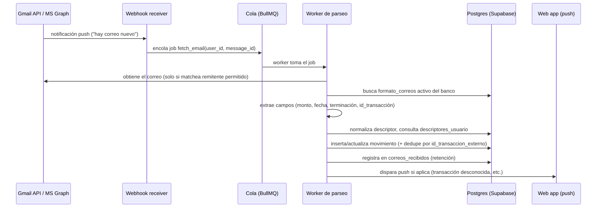

# Cacao — Arquitectura del bot de correos + detección de monto recurrente (v1)

Estado: **propuesta**, para tu revisión. Complementa
[`docs/stack-proposal.md`](./stack-proposal.md) (dónde vive el bot) y
[`docs/db-schema.md`](./db-schema.md) (qué tablas usa).

## Resumen en una imagen



## 1. Conexión OAuth (Gmail y Outlook)

- **Nunca IMAP con credenciales** — solo OAuth2, tal como exige
  DECISIONS.md.
- Scopes mínimos:
  - Gmail: `gmail.readonly` restringido — en v1 usamos el scope completo de
    lectura porque Cacao necesita poder leer cualquier remitente que el
    usuario configure (no se puede predecir de antemano), pero el bot
    **filtra en aplicación** para solo abrir mensajes cuyo remitente
    matchee un `formatos_correos.patron_remitente` activo. Nunca se
    procesa ni se guarda el contenido de otros correos.
  - Outlook: `Mail.Read` vía Microsoft Graph, mismo principio de filtrado
    en aplicación.
- Los `refresh_token` se guardan cifrados (KMS o equivalente del proveedor
  de hosting) en una tabla `oauth_tokens` separada (no en `users`), con
  `access_token` de corta vida obtenido on-demand — nunca se persiste el
  `access_token` más allá del proceso que lo usa.
- El usuario puede revocar el acceso desde Ajustes; eso dispara
  `revoke()` contra el proveedor y detiene cualquier `watch()`/suscripción
  activa para esa cuenta.

## 2. Suscripción a correos nuevos (sin polling constante)

Polling continuo sería lento y caro. En vez de eso:

- **Gmail**: `users.watch()` registra un topic de Google Cloud Pub/Sub que
  notifica al backend cuando hay actividad en el buzón. La suscripción
  **expira cada 7 días** — un job programado (`renew_gmail_watch`, corre
  diario) la renueva antes de que caduque para cada usuario conectado.
- **Outlook**: Microsoft Graph `subscriptions` con un `notificationUrl`
  propio. Expiran más rápido (~3 días para mail) — mismo patrón de job de
  renovación, más frecuente.
- Ambos webhooks solo entregan un identificador de que "algo cambió" (no
  el contenido) — el worker hace un fetch explícito del mensaje después,
  y ahí aplica el filtro de remitente antes de leer nada.

## 3. Pipeline de procesamiento (por correo)

Cada notificación entra a una cola BullMQ (`email-processing`) con
reintentos automáticos (3 intentos, backoff exponencial) y va a una cola
de fallidos (`email-processing-dlq`) si se agotan — esos casos quedan
visibles para debugging, nunca se pierden silenciosamente.

1. **Filtro de remitente**: ¿el `From` matchea algún
   `formatos_correos.patron_remitente` activo? Si no, se descarta sin
   abrir el cuerpo del mensaje.
2. **Extracción de campos** usando `formatos_correos.mapeo_campos` (ver
   sección 4) → monto, fecha, hora, terminación de cuenta,
   id_transacción, descriptor crudo, y una pista de tipo de movimiento
   (cargo/abono/pago a tarjeta).
3. **Créditos**: si la cuenta es `credito`, el mapeo clasifica el
   movimiento como `credit_expense` o `credit_payment` según el texto del
   correo (ver sección 4) — nunca se cuentan ambos como el mismo gasto.
4. **Normalización de descriptor**: quitar folios, fechas, espacios
   extra, mayúsculas consistentes → `descriptor_normalizado`.
5. **Categorización determinística** contra `descriptores_usuario` (y
   `comercios_genericos` para cold start) — lógica ya documentada en
   `docs/db-schema.md`.
6. **Detección de monto recurrente** (sección 5 de este documento) →
   puede forzar `tipo_gasto = 'fijo'`.
7. **Detección de reembolso** (sección 6) y **de cargo duplicado**
   (sección 7).
8. **Inserción en `movimientos`**, con `id_transaccion_externo` para que
   reprocesar el mismo correo dos veces (dentro del colchón de retención)
   no duplique nada — ya validamos que el índice único lo garantiza.
9. **Registro en `correos_recibidos`** con `fecha_borrado_programada` =
   ahora + colchón (48h prod / 7 días beta).
10. **Notificación push** si corresponde (transacción desconocida →
    `estado = necesita_revision`; o alguna de las de "recomendaciones de
    la app").

## 4. Formato del catálogo `formatos_correos.mapeo_campos`

Forma propuesta para el JSON (un ejemplo por campo, con selector para
correos HTML y regex de respaldo para texto plano):

```json
{
  "formato": "html",
  "monto": { "selector": ".monto", "regex": "\\$([0-9,]+\\.\\d{2})" },
  "fecha": { "selector": ".fecha", "regex": "(\\d{2}/\\d{2}/\\d{4})" },
  "hora": { "selector": ".hora", "regex": "(\\d{2}:\\d{2})" },
  "terminacion_cuenta": { "selector": ".cuenta", "regex": "(\\d{4})$" },
  "id_transaccion": { "selector": ".folio", "regex": "Folio:\\s*(\\w+)" },
  "descriptor_crudo": { "selector": ".comercio" },
  "tipo_movimiento": {
    "selector": ".concepto",
    "map": {
      "compra": "credit_expense",
      "cargo": "gasto",
      "pago a tu tarjeta": "credit_payment",
      "abono": "ingreso"
    }
  },
  "patron_reembolso": "devoluci[oó]n|reembolso|cancelaci[oó]n"
}
```

- El worker intenta `selector` primero (correo HTML), y cae a `regex`
  sobre el texto plano si el HTML cambió o no matcheó — esto es lo que
  permite detectar cuando **un banco cambió su formato**: si el
  porcentaje de correos de un `formatos_correos.version` que fallan la
  extracción supera un umbral (ej. 20% en 48h), se marca para revisión y
  se le pide al usuario afectado que suba un correo de ejemplo actualizado
  (ver sección 8).

## 5. Detección de "monto recurrente por descriptor"

Este es el mecanismo que decide cuándo una categoría por default
`variable` (el caso concreto de DECISIONS.md es **Ejercicio**, ej. una
mensualidad de gym) debe tratarse como `fijo` para un usuario en
particular. Vive en `descriptores_usuario` (columnas `monto_tipico`,
`veces_mismo_monto`, `fecha_ultimo_monto_recurrente`).

**Algoritmo**, al procesar un movimiento con `descriptor_normalizado` D y
monto M (valor absoluto, sin signo) en fecha F:

1. Buscar la fila de `descriptores_usuario` para `(user_id, D)`.
2. Si no existe fila → se crea con `monto_tipico = M`,
   `veces_mismo_monto = 1`, `fecha_ultimo_monto_recurrente = F`. No hay
   recurrencia todavía.
3. Si existe:
   - Calcular si `M` coincide con `monto_tipico` dentro de una
     **tolerancia del 1%** (cubre variaciones menores de redondeo/IVA,
     sin ser tan laxo que dos gastos distintos coincidan por casualidad).
   - Y si `F` está **al menos 20 días después** de
     `fecha_ultimo_monto_recurrente` (evita que dos compras iguales el
     mismo día, por coincidencia, se cuenten como "recurrencia mensual").
   - Si ambas condiciones se cumplen: `veces_mismo_monto += 1`,
     `fecha_ultimo_monto_recurrente = F`.
   - Si el monto no coincide: se reinicia — `monto_tipico = M`,
     `veces_mismo_monto = 1`, `fecha_ultimo_monto_recurrente = F` (nos
     interesa el patrón *actual*, no un promedio histórico — si el
     usuario cambió de plan en el gym, el monto viejo deja de contar).
4. **Umbral de activación**: cuando `veces_mismo_monto >= 2` (es decir, el
   mismo monto visto en al menos 3 fechas separadas por ~20+ días) **y**
   la categoría asignada tiene `tipo_default = 'variable'`, el
   `tipo_gasto` del movimiento se guarda como `'fijo'` en vez del default
   de la categoría. El usuario puede recategorizar manualmente en
   cualquier momento — esto es solo la sugerencia automática inicial.
5. Este mismo umbral (`veces_visto >= 2`) es el que ya usa la
   categorización por frecuencia (`docs/db-schema.md`) — reutilizamos el
   número para que el comportamiento sea predecible y fácil de explicar:
   *"con verlo 2 veces de la misma forma, Cacao ya confía en el patrón"*.

Por qué no se aplica a categorías `fijo` o `semi_fijo`: ya están donde
deben estar. Por qué no a `na` (Transferencia, Reembolso, Cashback,
Intereses): no son gasto real, la clasificación Fijo/Variable no aplica.

## 6. Detección de reembolso (con confirmación del usuario)

1. Un correo entrante matchea `formatos_correos.patron_reembolso` (ej.
   "devolución", "reembolso", "cancelación").
2. El worker extrae el monto M y busca en `movimientos` del mismo usuario
   una transacción **no reembolsada** con `monto = -M` (incluye signo,
   porque es un gasto) en los últimos ~90 días, idealmente del mismo
   comercio/descriptor.
3. Si encuentra un candidato razonable: marca ese movimiento con
   `posible_reembolso_pendiente = true` y guarda `monto_reembolso = M`,
   `fecha_reembolso = ahora` (como *propuesta*, no confirmado) — **nunca
   anula el gasto automáticamente**, tal como exige DECISIONS.md.
4. Se dispara una notificación pidiendo confirmación. Solo cuando el
   usuario confirma desde la app, la app pone `reembolsado = true` y
   `posible_reembolso_pendiente = false` — a partir de ahí el dashboard
   excluye ese movimiento del gasto del periodo.
5. Si el usuario rechaza la sugerencia, se limpia
   `posible_reembolso_pendiente` sin tocar el resto del movimiento.

## 7. Detección de cargo duplicado (recomendación de la app)

Notificación tipo "recomendaciones de la app" (agregada en la ronda de
diseño): si dos movimientos del mismo usuario, misma cuenta, mismo
`descriptor_normalizado` y mismo monto llegan dentro de una ventana corta
(mismo día, o menos de 2 horas de diferencia si hay hora disponible), se
marca el segundo con `posible_duplicado_de` apuntando al primero y se
genera una recomendación — **no se elimina ni se fusiona nada
automáticamente**, porque comprar dos veces lo mismo el mismo día puede
ser legítimo (dos cafés, por ejemplo). El usuario decide si era un error
del banco o una compra real.

## 8. Banco no soportado / cambio de formato

- **No soportado**: el usuario exporta un correo de ejemplo a PDF y lo
  sube desde la app → un flujo interno (revisión del equipo, no
  automático en v1) construye el `mapeo_campos` correspondiente y lo
  guarda como una fila nueva en `formatos_correos` con
  `fuente = 'usuario_pdf'`, reutilizable para cualquier otro usuario del
  mismo banco — nunca se guardan datos personales del PDF, solo el patrón
  técnico del formato.
- **Cambio de formato**: como se explicó en la sección 4, una caída en la
  tasa de extracción exitosa para una `formatos_correos.version` activa
  dispara una alerta interna y, del lado del usuario, un mensaje pidiendo
  que suba un correo actualizado — mismo flujo que "no soportado".

## 9. Retención y borrado de correos

- Cada correo procesado (con éxito o no) deja una fila en
  `correos_recibidos` con `fecha_borrado_programada`.
- Un job diario (`purge_correos`) llama al `delete` de la API del
  proveedor para los correos vencidos (48h en producción, 7 días en
  Beta) y marca `borrado = true`. Cacao nunca almacena el cuerpo del
  correo en su propia base de datos — el "borrado" es sobre el correo en
  la cuenta del proveedor, gestionado vía la misma API OAuth.

## 10. Seguridad y privacidad — resumen operativo

- El bot **nunca** hace un scan general del buzón: cada fetch está atado
  a un `message_id` específico que llegó por webhook, y el filtro de
  remitente corre antes de leer el cuerpo.
- `descriptores_usuario` (aprendizaje por usuario) nunca se lee ni se
  escribe cruzando `user_id` — reforzado además por RLS a nivel de base
  de datos (`docs/db-schema.md`).
- `formatos_correos` y `comercios_genericos` — las únicas tablas
  compartidas — nunca contienen montos, fechas de transacciones, ni
  ningún dato personal; solo patrones técnicos de formato.
- Los tokens OAuth se cifran en reposo y solo el servicio del bot (rol de
  servicio) puede leerlos — nunca se exponen al cliente web.
